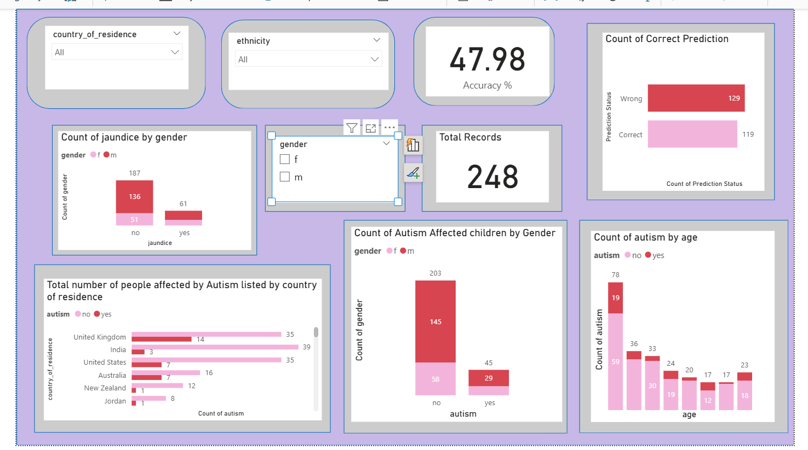

# Autism Screening Analytics

##  Objective
Analyze and visualize **Autism Spectrum Disorder (ASD) screening data for children**, focusing on:
- Demographic trends  
- Predictive outcomes  
- Key performance metrics  
to support **data-driven insights and decision-making**.

---

##  Tools & Technologies
- **Python:** Data cleaning, preprocessing, and transformation (Pandas, NumPy, SciPy)  
- **SQL:** Data querying, aggregation, and database-level analysis  
- **Power BI:** Interactive dashboard creation for visualization and reporting  

---

##  Methodology & Implementation

### 1️⃣ Data Preprocessing (Python)
- Loaded dataset from **ARFF format → CSV** for analysis.  
- Decoded object columns, handled missing values, and replaced invalid entries.  
- Renamed columns for clarity (`jundice → jaundice`, `austim → autism`, etc.).  
- Exported a **clean dataset** for SQL and Power BI usage.  

### 2️⃣ Database Analysis (SQL)
- Queried and explored dataset structure and counts to assess data quality.  
- Cleaned inconsistencies and standardized column names with `DELETE` and `ALTER` statements.  
- Performed **aggregations/groupings** to analyze autism prevalence by **country, age, gender, jaundice status**.  
- Evaluated **prediction accuracy** by comparing actual vs. predicted labels.  

### 3️⃣ Interactive Dashboard (Power BI)
- Developed a **Power BI dashboard** to visualize autism screening across demographics.  
- Added **dynamic filters** (country, gender, ethnicity) for interactive analysis.  
- Visualized KPIs: **prediction accuracy, correct vs. wrong predictions, age distribution, demographics**.  
- Applied best practices in layout and storytelling for usability.  

---

##  Power BI

### 🔹 KPI Cards
- **Total Records:** 248 (post-cleaning)  
- **Accuracy %:** 47.98% (119 correct, 129 wrong)
  
 

### 🔹 Autism by Age
- Most cases concentrated in **ages 4–11**.  
- Focus on early childhood and pre-adolescence.  

### 🔹 Autism by Gender
- More **males** affected than females.  
- Aligns with established autism research findings.  

### 🔹 Autism by Country of Residence
- Highest cases from **UK, India, and USA**.  
- Both “yes” and “no” contribute → overall distribution, not prevalence.  

### 🔹 Jaundice by Gender
- Autism occurs **with and without jaundice** → no strong correlation.  

### 🔹 Correct vs Wrong Predictions
- **Correct:** 119 | **Wrong:** 129  
- Predictive model underperforms → accuracy below 50%.  

### 🔹 Filters (Slicers)
- Interactive filters by **country** and **ethnicity** for focused exploration.  

---

##  Dashboard Preview

---

##  Outcomes
- Created a **clean, structured dataset** ready for analysis.  
- Derived **actionable insights** on demographics, prevalence, and model performance.  
- Developed a **user-friendly Power BI dashboard** enabling stakeholders to:  
  - Explore demographic patterns  
  - Assess prediction reliability  
  - Apply filters for targeted insights  

---

